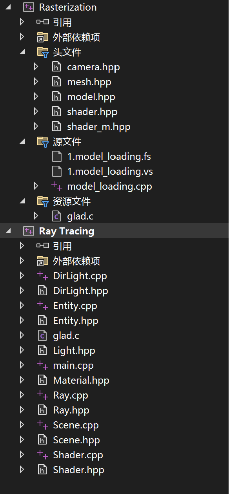
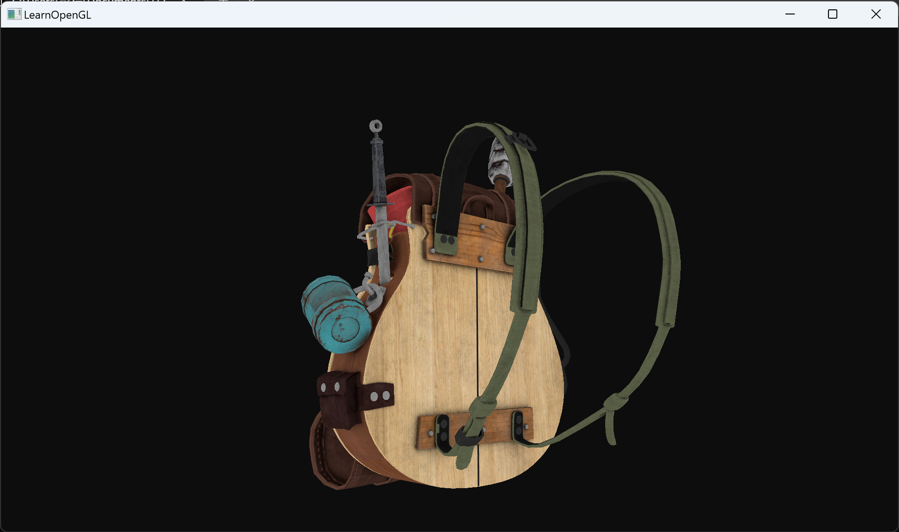
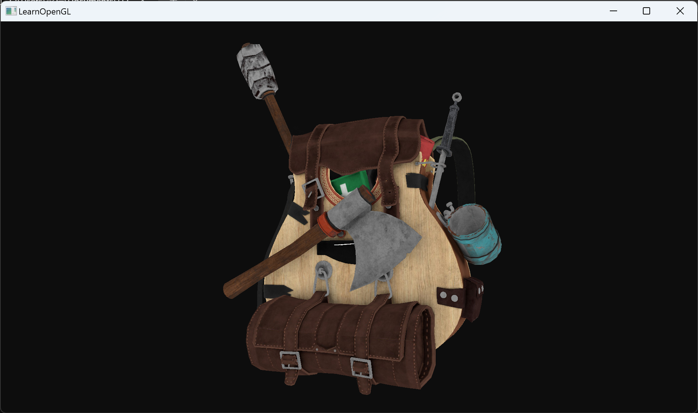
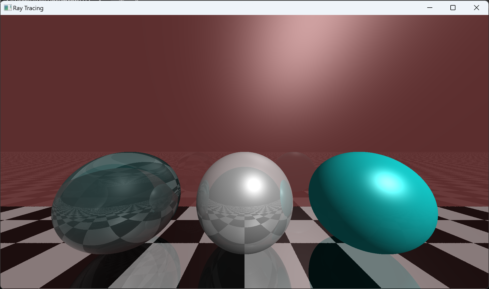

# Rasterization-Ray-Tracing
Term project I for Computer Graphics

Environment: Visual Studio 2022

选择对应项目，右键-设为启动项目，点击运行即可。

### 项目一：传统光栅化

实现了一个基于OpenGL和C++，支持模型加载+纹理贴图渲染+自由摄像机的传统光栅化程序。

用法：键盘WASD进行摄像机位置控制，滚轮控制缩放系数，鼠标移动控制视角。

### 项目二：光线追踪

在给出的光线追踪的代码上进行了理解，调大了渲染分辨率并加入了新的物体和材质。

光源从右后方射出，后面红色的墙板材质以环境光为主，带有10%的反射光。左边的玻璃球带有强的反射和折射，中间带有强反射，产生金属质感。右边的球以环境光为主，不进行反射和折射，因此带有橡胶的塑料材质。
